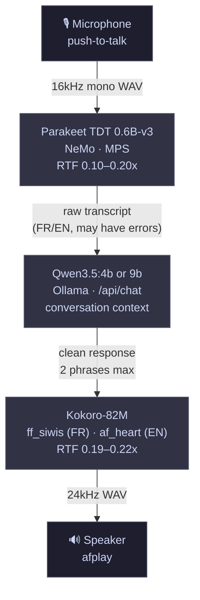

# VoiceLLM

Fully local, low-latency voice assistant running entirely on Apple Silicon (M3 Pro, 18 GB). No cloud, no API keys, no internet required.

**Round-trip latency: ~4–6s** (warm, qwen3.5:4b) — STT 0.5s · LM 3s · TTS 1s

---

## Architecture



---

## Models

| Component | Model | Backend | VRAM | RTF |
|-----------|-------|---------|------|-----|
| STT | [Parakeet TDT 0.6B-v3](https://huggingface.co/nvidia/parakeet-tdt-0.6b-v3) | NeMo / MPS | ~0.9 GB | 0.10–0.20x |
| LM | [Qwen3.5:4b](https://ollama.com/library/qwen3.5) *(default)* | Ollama | ~3.4 GB | — |
| LM | [Qwen3.5:9b](https://ollama.com/library/qwen3.5) *(optional)* | Ollama | ~6.0 GB | — |
| TTS | [Kokoro-82M](https://huggingface.co/hexgrad/Kokoro-82M) | PyTorch / CPU | ~0.3 GB | 0.19–0.22x |
| **Total (4b)** | | | **~4.6 GB** | |
| **Total (9b)** | | | **~7.2 GB** | |

---

## Features

- 🇫🇷🇬🇧 **Bilingual** — French, English, and FR/EN code-switching handled natively
- 🗣 **Dynamic TTS voice routing** — `ff_siwis` for French responses, `af_heart` for English, detected automatically from LM output using a shared Kokoro model (weights loaded once)
- 🧠 **Conversation context** — 5-turn sliding window, auto-reset after 5 minutes
- ⚡ **Fast** — all models loaded once at startup, kept in memory
- 🔒 **Fully offline** — zero network calls during inference
- 📋 **Timestamped logs** — every run logged to `logs/`
- 🎛 **Selectable LM** — `--model qwen3.5:4b` (default, ~5s) or `--model qwen3.5:9b` (~10–25s, better quality)

---

## Requirements

- macOS (Apple Silicon recommended — M1/M2/M3)
- Python 3.11+
- [Ollama](https://ollama.com) running locally with `qwen3.5:4b` pulled

---

## Installation

```bash
# Clone
git clone <repo-url>
cd VoiceLLM

# Dependencies
pip install kokoro soundfile sounddevice httpx
pip install nemo_toolkit[asr]

# Pull LM (4b — default)
ollama pull qwen3.5:4b

# Pull LM (9b — optional, higher quality, slower)
ollama pull qwen3.5:9b
```

---

## Usage

### Full pipeline (recommended)

```bash
python pipeline.py                        # qwen3.5:4b (default)
python pipeline.py --model qwen3.5:9b    # higher quality, ~10–25s round-trip
python pipeline.py --no-play             # transcribe + LM only, no audio output
```

Press **Enter** to start recording, **Enter** again to stop. The pipeline transcribes, generates a response, and plays it back.

### Individual components

```bash
# TTS only
python tts.py "Bonjour, comment ça va ?"
python tts.py --test

# LM only
python lm.py "c'est quoi un trou noir"
python lm.py --test
python lm.py --model qwen3.5:9b --test
python lm.py --wire "quelle heure il est"   # LM → TTS → audio

# STT only
python stt.py                   # push-to-talk
python stt.py --file audio.wav  # transcribe a file
```

---

## File Structure

```
VoiceLLM/
├── pipeline.py      # full loop — mic → STT → LM → TTS → speaker
├── stt.py           # Parakeet STT wrapper
├── lm.py            # Ollama LM wrapper (stateless + chat history)
├── tts.py           # Kokoro TTS wrapper
├── log_utils.py     # shared timestamped logging
├── bench_mlx.py     # TTS backend benchmark (llama.cpp vs mlx-audio)
└── CLAUDE.md        # architecture decisions and gotchas
```

---

## Latency Profile (M3 Pro, warm models)

### qwen3.5:4b — recommended for real-time

| Stage | Typical | Notes |
|-------|---------|-------|
| STT (Parakeet) | 0.5–0.8s | for a 4–10s utterance |
| LM (Qwen3.5:4b) | 1.5–3.5s | depends on response length |
| TTS (Kokoro) | 0.9–2.0s | RTF ~0.2x |
| **Round-trip** | **~4–6s** | warm, short response |

### qwen3.5:9b — better quality, slower

| Stage | Typical | Notes |
|-------|---------|-------|
| STT (Parakeet) | 1–4s | degraded — memory pressure |
| LM (Qwen3.5:9b) | 5–15s | warm; first call ~13s |
| TTS (Kokoro) | 2–5s | RTF ~0.2–0.4x |
| **Round-trip** | **~10–25s** | not recommended for real-time |

Cold start (first run): +3–5s for Ollama model load.

---

## Decision Log

| Decision | Rejected | Chosen | Reason |
|----------|----------|--------|--------|
| TTS engine | OuteTTS (llama.cpp Q8_0) | **Kokoro-82M** | OuteTTS produced distorted audio ~50% of the time on M3 Pro — stochastic sampling instability. Kokoro is deterministic, RTF 0.19–0.21x, clean French output. |
| OuteTTS backend | mlx-audio BF16 (RTF 3.7x) | llama.cpp Q8_0 (RTF 3.1x) | Benchmarked in `bench_mlx.py` — llama.cpp faster, but both superseded by Kokoro. |
| LM size | Qwen3.5:2b | **Qwen3.5:4b** | 2b hallucinated facts and ignored language rules. 4b stable with no observable latency regression. |
| LM API | `/api/generate` | **`/api/chat`** | `/api/generate` is stateless. `/api/chat` supports conversation history natively. |
| TTS lang routing | single pipeline (FR only) | **dual pipeline, shared KModel** | `KPipeline.lang_code` is fixed at init. Sharing one `KModel` avoids loading weights twice. FR→`ff_siwis`, EN→`af_heart`, detected via function word heuristic. |
| Default LM size | 9b | **4b** | 9b causes STT degradation (RTF 1.0x vs 0.1x) and 10–25s round-trips due to memory pressure. 4b hits the sweet spot at ~5s. |

---

## Roadmap

- [x] Phase 1 — TTS standalone (Kokoro-82M)
- [x] Phase 2 — LM integration (Qwen3.5:4b via Ollama)
- [x] Phase 3 — STT integration (Parakeet TDT 0.6B-v3)
- [x] Phase 3.5 — Dynamic FR/EN TTS routing (shared KModel)
- [x] Phase 3.6 — Selectable LM (`--model qwen3.5:4b|9b`)
- [ ] Phase 4 — Web grounding (DuckDuckGo + Wikipedia, no API key)

---

## License

MIT
